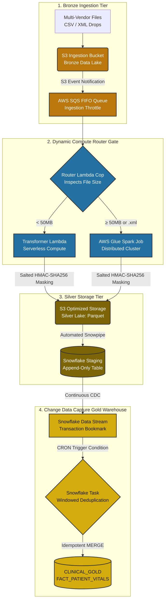

# Enterprise Healthcare Data Platform: Automated AWS & Snowflake ELT Pipeline

An event-driven, production-grade cloud data engineering platform designed to ingest, process, and securely warehouse multi-vendor clinical vitals data. 

This repository demonstrates an advanced **Dynamic Compute Router Pattern** using AWS serverless architectures coupled with an automated, idempotent Change Data Capture (CDC) engine inside Snowflake.

---

## 🏗️ Architecture Blueprint

The platform implements a decoupled, three-tier data lake pattern optimized for operational cost efficiency and strict HIPAA data governance.


----

### 🧠 Core Engineering Design Patterns

1. **Dynamic Compute Routing:** To balance execution velocity against cloud expenditure, a lightweight traffic cop Lambda inspects file payloads streaming from an **SQS FIFO Queue**. Micro-batches under 50MB bypass heavy infrastructure and invoke an asynchronous, serverless Lambda execution tier. Payload files exceeding 50MB or requiring nested schema parsing (.xml) are routed to auto-scaling **AWS Glue (PySpark)** clusters to avoid execution timeouts.
2. **Cryptographic PHI Governance:** To ensure HIPAA alignment, sensitive patient cleartext identifiers (`patient_id`) are intercepted at the cloud compute boundary. A deterministic hash is generated using **HMAC SHA-256** combined with a secret, rotating organizational salt token. This eliminates the storage of raw protected health information while preserving relational join integrity across analytical pipelines.
3. **Idempotent Storage Strategy:** Concurrent network file drops can introduce duplicated transaction boundaries. To enforce absolute database idempotency, data is loaded via Snowpipe into an append-only staging table. A reactive Snowflake **Stream** acts as a micro-batch cursor tracking updates. An automated Snowflake **Task** uses windowed deduplication partition passes (`QUALIFY ROW_NUMBER()`) and updates the production Gold tier via an atomic atomic table `MERGE`.

---

## 📂 Repository Structure

```text
healthcare-data-platform-aws-snowflake/
├── .github/workflows/
│   └── ci-cd-pipeline.yml     # CI/CD: Automated Python linters & PyTest suites
├── terraform/                  # Infrastructure as Code (IaC) Tier
│   ├── main.tf                 # Core cloud network and permission architectures
│   ├── variables.tf            # Environment input mappings
│   └── providers.tf            # State-locking configuration blocks
├── src/                        # Compute Application Tier
│   ├── lambda/
│   │   ├── router_handler.py   # Traffic cop file size inspector
│   │   ├── lambda_function.py  # Lightweight Parquet processing module
│   │   └── test_lambda.py      # Deterministic validation and testing blocks
│   └── glue/
│       └── glue_spark_job.py   # Scale-out PySpark transformation script
├── snowflake/                  # Enterprise Warehousing Tier
│   └── setup_warehouse.sql     # Streams, tasks, clustering, and CDC architecture
└── README.md
