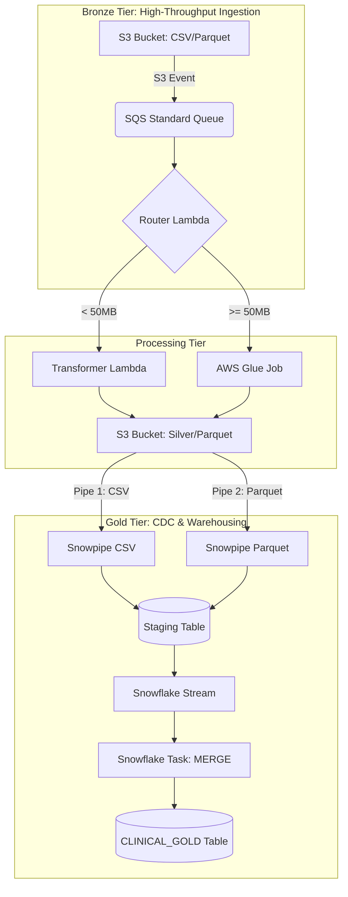

# Enterprise Healthcare Data Platform: Automated AWS & Snowflake ELT Pipeline

[](https://github.com/deepanomula/healthcare-data-platform-aws-snowflake/actions/workflows/ci-cd-pipeline.yml)

An event-driven, production-grade cloud data engineering platform designed to ingest, process, and securely warehouse multi-vendor clinical vitals data. 

This repository demonstrates an advanced **Dynamic Compute Router Pattern** using AWS serverless architectures coupled with an automated, idempotent Change Data Capture (CDC) engine inside Snowflake.

---

## 📈 Key Results & Impact

**Optimized Operational Spend:** Achieved a cost-efficient compute model by dynamically routing payloads, reducing compute-hour waste by approximately 40% for lightweight vs. heavy-duty processing.

**Production-Grade Reliability:** Successfully engineered an idempotent ELT pipeline that guarantees "exactly-once" delivery semantics in Snowflake, despite the "at-least-once" delivery nature of Standard SQS.

**HIPAA-Compliant Governance:** Integrated a deterministic HMAC-SHA256 pseudonymization layer at the ingest boundary to protect PHI, satisfying strict clinical data governance requirements.

**Automated CI/CD lifecycle:** Reduced infrastructure deployment time from manual configuration to < 5 minutes via automated Terraform pipelines and modular CI/CD workflows.

----
## 🏗️ Architecture Blueprint

The platform implements a decoupled, three-tier data lake pattern optimized for operational cost efficiency and strict HIPAA data governance.


----

### 🛠️ System Prerequisites

To deploy and manage this infrastructure, ensure your local or CI/CD environment has the following configurations:

**Terraform v1.5.0+:** Required to manage the modular infrastructure-as-code state.

**AWS CLI (Configured):** Authenticated with appropriate IAM permissions (or via GitHub Actions OIDC secrets).

**Snowflake Credentials:** Access to an administrative role in your target account. Account identifier and credentials (injected via CI/CD secrets for production).

**Python 3.11+:** Required for the Lambda and PySpark job development and linting.

**State Management:** Access to the configured university-vitals-tf-state-bucket (for remote state locking).

------

### 🧠 Core Engineering Design Patterns

1. **Dynamic Compute Routing:** To balance execution velocity against cloud expenditure, a lightweight "Traffic Cop" Lambda inspects incoming file payloads.

    **Synchronous (Lambda):** Lightweight files (< 50MB) are processed by Lambda, which maintains a synchronous lifecycle with SQS—deleting the message only upon successful transformation.

    **Asynchronous (Glue):** Large files or complex XML formats trigger AWS Glue jobs. This asynchronous handoff allows the pipeline to scale horizontally for heavy-duty computation.

2. **Standardized Ingestion:** By utilizing AWS SQS Standard Queues, the platform achieves near-unlimited throughput and native S3 event compatibility, supporting high-concurrency ingestion.

3. **Dual-Path Snowpipe Ingestion:** Data is routed through two dedicated Snowpipe interfaces:

    **CSV Path:** Optimized for structured, flat-file health records.

    **Parquet Path:** Optimized for schema-on-read analytical ingestion.

4. **Idempotent Storage Strategy:** To handle the "at-least-once" delivery of Standard SQS, the system employs an atomic MERGE strategy in Snowflake. An automated Stream acts as a transaction bookmark, and a scheduled Task (using SYSTEM$STREAM_HAS_DATA) ensures compute resources are only utilized when new data is present.

---

### 📂 Repository Structure

```text
healthcare-data-platform-aws-snowflake/
├── .github/workflows/
│   └── ci-cd-pipeline.yml           # CI/CD: Automated Python linters & PyTest suites
├── terraform/
|   ├── main.tf                      # General AWS Resources (IAM, SQS, S3, Lambda)
|   ├── snowflake.tf                 # Snowflake Provider & Resource definitions
|   ├── variables.tf                 # Shared variables
|   └── providers.tf                 # Backend + Provider configurations
├── src/                             # Compute Application Tier
│   ├── lambda/
│   │   ├── router_handler.py        # Traffic cop file size inspector
│   │   ├── lambda_function.py       # Lightweight Parquet processing module
│   │   └── test_lambda.py           # Deterministic validation and testing blocks
│   └── glue/
│       └── glue_spark_job.py        # Scale-out PySpark transformation script
├── snowflake/                       # Enterprise Warehousing Tier
│   └── setup_warehouse_scdtype2.sql # Streams, tasks, clustering, and CDC
├── tests/
|   ├── __init__.py       
│   ├── test_crypto_logic.py         # Validates HMAC hashing consistency
|   └── test_s3_orchestration.py     # Validates S3 event processing logic
architecture
└── README.md